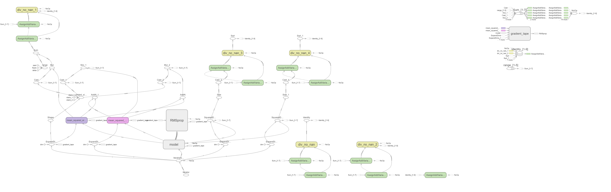

<h1 align=center>Building Model to Predict Heating and Cooling Load</h1>

<small>Picture Source: <a  href="https://github.com/doguilmak">Doğu İlmak</a></small>

 

<h2>Data Set Information:</h2>

We perform energy analysis using <i>12</i> different building shapes simulated in <i>Ecotect</i>. The buildings differ with respect to the <i>glazing area</i>, <i>the glazing area distribution</i>, and the <i>orientation</i>, amongst other parameters. We simulate various settings as functions of the <i>afore-mentioned</i> characteristics to obtain <i>768 building shapes</i>. The dataset comprises <i>768</i> samples and <i>8</i> features, aiming to predict <i>two real valued responses</i>. It can also be used as a <i>multi-class classification problem</i> if the response is rounded to the nearest integer. <b>All the informations about data set referred from <a  href='https://archive.ics.uci.edu/ml/datasets/Energy+efficiency'>archive.ics.uci.edu</a>.</b>

  

<h2>Keywords</h2>

<ul>
	<li>Neural Networks</li>
	<li>Energy Efficiency</li>
	<li>Regression</li>
	<li>Computer Science</li>
	<li>Deep Learning</li>
</ul>

 

<h2>Attribute Information</h2>  

The dataset contains eight attributes (or features, denoted by X1...X8) and two responses (or outcomes, denoted by y1 and y2). <b>The aim is to use the eight features to predict each of the two responses.</b>

<ol>
	<li>X1 Relative Compactness</li>
	<li>X2 Surface Area</li>
	<li>X3 Wall Area</li>
	<li>X4 Roof Area</li>
	<li>X5 Overall Height</li>
	<li>X6 Orientation</li>
	<li>X7 Glazing Area</li>
	<li>X8 Glazing Area Distribution</li>
	<li><b>Output variables: </b></li>
	<ul>
	<li><i>y1 Heating Load</i></li>
	<li><i>y2 Cooling Load</i></li>
	</ul>
</ol>

 

<h2>Relevant Papers</h2> 

<ul>
	<li><b>A. Tsanas, A. Xifara: 'Accurate quantitative estimation of energy performance of residential buildings using statistical machine learning tools'</b>, Energy and Buildings, Vol. 49, pp. 560-567, 2012</li>
</ul>  

<h2>Citation Request</h2> 

<ul>
	<li><b>A. Tsanas, A. Xifara: 'Accurate quantitative estimation of energy performance of residential buildings using statistical machine learning tools'</b>, Energy and Buildings, Vol. 49, pp. 560-567, 2012</li>   
	<li>For further details on the data analysis methodology: <b>A. Tsanas, 'Accurate telemonitoring of Parkinson's disease symptom severity using nonlinear speech signal processing and statistical machine learning'</b>, D.Phil. thesis, University of Oxford, 2012</li>
</ul>

 

<h2>Objectives</h2>

 <ul>
	<li>Understand the data set & cleanup (data pre-processing).</li>
	<li>Build <i>Multi-output</i> model to predict heating and cooling loan. Afterwards, evaluate the model.</li>
</ul>

 

<h2>Files</h2>

<ol>
	<li>
Heating and cooling loan prediction with <i>multi-output model</i>: <a href="https://github.com/doguilmak/Red-Wine-Quality-Prediction/blob/main/wine_ann.ipynb">energy_efficiency.ipynb</a>. You can use the model last parameters with loading <a  href="https://github.com/doguilmak/Predict-Heating-and-Cooling-Load/blob/main/saved_model/last_model.h5">last_model.h5</a> or you can use the whole model <a  href="https://github.com/doguilmak/Predict-Heating-and-Cooling-Load/tree/main/saved_model">here</a>.
</li>
	<li>
You can review model's <i>loss</i> and <i>mean squared error</i> values in each step: <a href="https://github.com/doguilmak/Predict-Heating-and-Cooling-Load/blob/main/training.csv">training.csv</a>. 
</ol>

 

<h2>Main Graph</h2>

 

<h2>References</h2>

<ol>
	<li><a href="https://laurencemoroney.com/">Laurence Moroney</a></li>
	<li><a href="https://www.tensorflow.org/tensorboard?hl=tr">TensorFlow Tensorboard</a></li>
</ol>

 

<h2>Contact Me</h2>

If you have something to say to me please contact me:
 

<ul>
	<li>Twitter: <a  href="https://twitter.com/Doguilmak">Doguilmak</a></li>
	<li>Mail address: doguilmak@gmail.com</li>
</ul>
